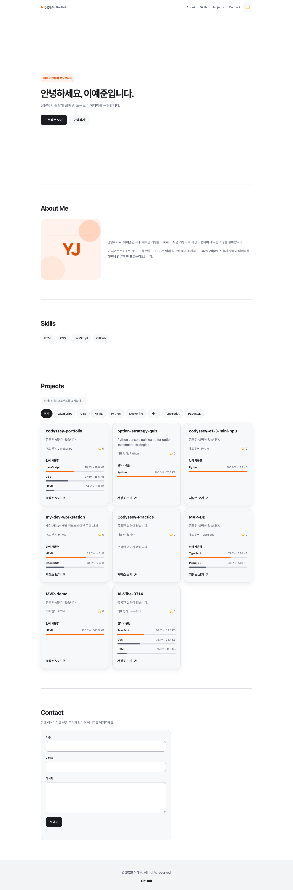
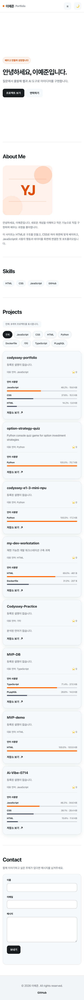
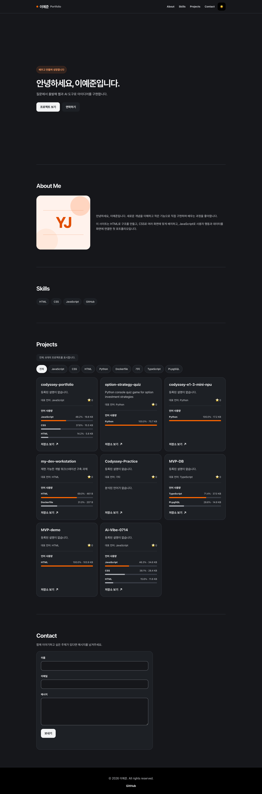

# 이예준 포트폴리오

순수 HTML, CSS, JavaScript로 만든 반응형 한 페이지 포트폴리오입니다. 사용자 이벤트가 상태를 바꾸고, 바뀐 상태가 화면에 반영되는 흐름을 직접 구현했습니다.

- 배포 주소: https://juny030507.github.io/codyssey-portfolio/
- 소스 코드: https://github.com/juny030507/codyssey-portfolio

## 주요 기능

- 모바일 메뉴, 앵커 이동, 스크롤에 따른 헤더와 맨 위 버튼
- 시스템 테마 감지와 다크 모드 선택값의 로컬스토리지 저장
- Intersection Observer를 이용한 섹션 등장 효과와 Hero 타이핑 효과
- 이름, 이메일, 메시지 검증 및 Formspree를 통한 실제 문의 전송
- GitHub REST API에서 최근 공개 저장소 최대 12개와 각 저장소의 언어 사용량 가져오기
- 사용된 모든 언어를 기준으로 필터링, 로딩·성공·빈 목록·오류/재시도 상태

사용한 기술은 HTML5, CSS3, JavaScript, GitHub REST API, Formspree입니다. 프레임워크나 UI 라이브러리는 사용하지 않았습니다.

## 디자인 기준

스타일은 [SEED Design Foundations](https://seed-design.io/foundations/llms.txt)의 역할 기반 색상, 시스템 글꼴, 간격·모서리 스케일을 참고해 순수 CSS로 구성했습니다. 밝은/어두운 테마 모두에서 배경·표면·텍스트·경계·포커스 색을 역할별 변수로 분리하고, 콘텐츠 너비를 1040px로 제한했습니다. 주요 액션은 진한 중립색, 보조 액션은 낮은 강조도의 배경색, 언어 필터는 선택 상태가 구분되는 칩 형태로 표현했습니다. 입력창은 레이블·포커스·오류 상태를 유지합니다.

공식 React/Lynx 컴포넌트를 설치한 것은 아닙니다. 이 포트폴리오의 기존 HTML·JavaScript 구조를 유지하면서 SEED의 공통 디자인 원칙을 적용한 스타일입니다.

## 로컬 실행

VS Code에서 이 폴더를 열고 Live Server로 `index.html`을 실행합니다. 또는 이 폴더에서 다음 명령을 실행한 뒤 `http://127.0.0.1:8765/`에 접속할 수 있습니다.

```bash
python3 -m http.server 8765
```

별도의 설치나 빌드 단계는 없습니다.

## 구현 흐름

- 메뉴 버튼 클릭 → `isMenuOpen` 변경 → `active` 클래스와 `aria-expanded` 갱신
- 테마 버튼 클릭 → `currentTheme` 변경·저장 → CSS 변수와 버튼 레이블 갱신
- GitHub 목록 요청 → 저장소별 언어 요청 → 바이트 수로 비율 계산 → 카드와 상태 문장 갱신
- 언어 버튼 클릭 → `selectedLanguage` 변경 → `filter()`로 고른 카드 다시 그리기
- 문의 제출 → 필드 검증 → 전송 중/성공/실패 상태 표시

저장소 목록은 `GET /users/juny030507/repos?sort=updated&per_page=12`에서 가져옵니다. 이어서 각 저장소의 `GET /repos/{owner}/{repo}/languages`를 호출합니다. 이 응답은 언어별 **코드 바이트 수**이며, 실행 시간이나 코드 줄 수가 아닙니다. 카드의 비율은 `해당 언어 바이트 수 ÷ 그 저장소의 전체 언어 바이트 수 × 100`으로 계산합니다. 필터는 대표 언어뿐 아니라 실제 사용된 모든 언어를 대상으로 하며, 필터 클릭 시 API를 다시 호출하지 않습니다.

인증하지 않은 GitHub API는 IP 주소 기준 시간당 60회 제한이 있습니다. 처음에는 저장소 목록 1회와 저장소당 언어 조회 1회가 필요합니다. 언어 조회는 한 번에 최대 3개씩 진행하고, 결과를 저장소의 `pushed_at` 값과 함께 브라우저에 30분간 저장해 반복 새로고침으로 인한 호출을 줄입니다. 일부 언어 조회가 실패해도 저장소 카드는 표시하며, 가능한 경우 저장된 정보를 사용합니다. 브라우저 코드에 GitHub 개인 토큰은 넣지 않습니다.

스크롤 맨 위 버튼은 300px, 헤더 배경 변경은 60px부터 작동합니다. 섹션 등장 효과의 `IntersectionObserver` 임계값은 `0.2`입니다. 사용자가 움직임 최소화를 설정하면 등장 애니메이션과 타이핑 효과를 생략합니다.

## 문의 폼 설정

Formspree에서 만든 폼의 `https://formspree.io/f/FORM_ID` 주소 중 `FORM_ID`를 `index.html`의 `data-formspree-id`에 넣었습니다. 이 값은 폼의 공개 주소 일부이며 비밀번호나 API 비밀키가 아닙니다. 폼 ID가 비어 있으면 실제 전송을 시도하지 않고 설정 안내를 표시합니다. 전송 성공 응답을 받은 경우에만 성공 메시지를 보여주고 입력값을 비웁니다.

## 폴더 구성

```text
index.html          시맨틱 페이지 구조
css/style.css       반응형 레이아웃과 테마
js/main.js          이벤트, 상태, API, 폼 처리
images/profile.svg  프로필 이니셜 일러스트
screenshots/        현재 디자인의 데스크톱·모바일·다크 모드 화면
```

## 화면

아래 이미지는 현재 저장소 코드를 로컬 Chrome에서 실행해 캡처한 전체 페이지 화면입니다.

### 데스크톱 (1440 × 900)



### 모바일 (500 × 844)



### 다크 모드 (1440 × 900)


